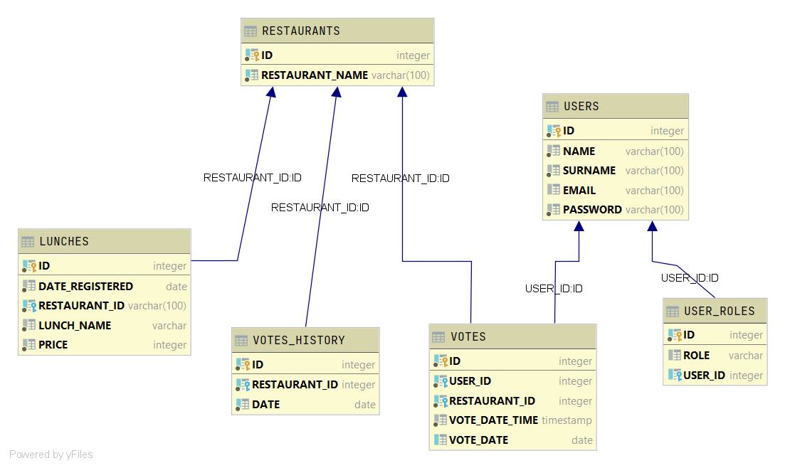

# topjava-graduation

TOPJAVA-GRADUATION PROJECT

---

# project requirements

Design and implement a REST API using Hibernate/Spring/SpringMVC (or Spring-Boot) without frontend.

The task is:

Build a voting system for deciding where to have lunch.

- [ ] 2 types of users: admin and regular user

- [ ] Admin can input a restaurant and it's lunch menu of the day (2-5 items usually, just a dish name and price)

- [ ] Menu changes each day (admins do the updates)

- [ ] Users can vote on which restaurant they want to have lunch at

- [ ] Only one vote counted per user

- [ ] If user votes again the same day:

    - [ ] If it is before 11:00 we assume that he changed his mind.

    - [ ] If it is after 11:00 then it is too late, vote can't be changed Each restaurant provides a new menu each day.

As a result, provide a link to github repository. It should contain the code, README.md with API documentation and
couple curl commands to test it.

---
P.S.: Make sure everything works with latest version that is on github :)

P.P.S.: Assume that your API will be used by a frontend developer to build frontend on top of that.

---

#          * RESULTS

---

##          * SWAGGER documentation

* Json Format documentation
  http://localhost:8080/api-docs/
* Swagger UI documentation
  http://localhost:8080/swagger-ui.html

---

##          * SECURITY CONFIGS

### ADMIN:  

admin@mail.ru : admin

### USER:  

user@mail.ru : user

---

##          * DATABASE MODEL STRUCTURE

---

##    * Postman Project Url

- [Link to Postman Project File](config/topjava-graduation.postman_collection.json)

---

##       * LIST of CURL Commands

### RESTAURANT CONTROLLER

<i>- Get All Restaurants (user+admin):</i>

    curl --user user@mail.ru:user -L -X GET 'http://localhost:8080/rest/restaurants'

<i>- Get Restaurant With ID = 100009 (user+admin):</i>

    curl --user user@mail.ru:user -L -X GET 'http://localhost:8080/rest/restaurants/100009'

<i>- Save New Restaurant with Name="New_Restaurant" (admin):</i>

    curl --user admin@mail.ru:admin -L -X POST 'http://localhost:8080/rest/restaurants' -H 'Content-Type: application/json' --data-raw '{"restaurantName": "New_Restaurant"}'

<i>- Update Restaurant With ID = 100009: (admin)</i>

    curl --user admin@mail.ru:admin -L -X PUT 'http://localhost:8080/rest/restaurants/100009' -H 'Content-Type: application/json' --data-raw '{"restaurantName": "Russian Pub New Name"}'

<i>- Delete Restaurant With ID = 100010: (admin)</i>

    curl --user admin@mail.ru:admin -L -X DELETE 'http://localhost:8080/rest/restaurants/100010'

### USER CONTROLLER

<i>- Get All Users (admin):</i>

    curl --user admin@mail.ru:admin -L -X GET 'http://localhost:8080/rest/users'

<i>- Find User By Name="Azat" (admin):</i>

    curl --user admin@mail.ru:admin -L -X GET 'http://localhost:8080/rest/users/by/name?name=Azat'

<i>- Get User By Id=100000 (admin):</i>

    curl --user admin@mail.ru:admin -L -X GET 'http://localhost:8080/rest/users/by/id?id=100000'

### LUNCH CONTROLLER

<i>- Get All Lunches (admin+user):</i>

    curl --user user@mail.ru:user -L -X GET 'http://localhost:8080/rest/lunches'

<i>- Get Lunch By Id = 100014 (admin+user):</i>

    curl --user user@mail.ru:user -L -X GET 'http://localhost:8080/rest/lunches/100014'

<i>- Get List of Lunches By RestaurantId = 100008 (admin+user):</i>

    curl --user user@mail.ru:user -L -X GET 'http://localhost:8080/rest/lunches/by_restaurant?id=100008'

<i>- Get List of Lunches Between Dates =  (admin+user):</i>

    curl --user user@mail.ru:user -L -X GET 'http://localhost:8080/rest/lunches/filter/between?startDate=2021-01-02&endDate=2021-01-02'

<i>- Get List of Lunches By Date = 2021-01-02 =  (admin+user):</i>

    curl --user user@mail.ru:user -L -X GET 'http://localhost:8080/rest/lunches/filter/date?date=2021-01-02'

<i>- Save New Lunch (admin):</i>

    curl --user admin@mail.ru:admin -L -X POST 'http://localhost:8080/rest/lunches' -H 'Content-Type: application/json' --data-raw '{"dateRegistered": "2021-05-10", "lunchName": "New Lunch", "price": 777, "restaurantId": 100008}'

<i>- Update Existing Lunch With Id = 100014 (admin):</i>

    curl --user admin@mail.ru:admin -L -X PUT 'http://localhost:8080/rest/lunches/100014' -H 'Content-Type: application/json' --data-raw '{"dateRegistered": "2021-01-01","lunchName": "New Description","price": 710,"restaurantId": 100008}'

<i>- Delete Lunch With Id = 100015 (admin):</i>

    curl --user admin@mail.ru:admin -L -X DELETE 'http://localhost:8080/rest/lunches/100015'

### VOTE CONTROLLER

<i>- Get Authorized User Votes (user):</i>

    curl --user user@mail.ru:user -L -X GET 'http://localhost:8080/rest/votes/user_votes'

<i>- Get Vote By Id = 100034 (admin):</i>

    curl --user admin@mail.ru:admin -L -X GET 'http://localhost:8080/rest/votes/by/id?id=100034'

<i>- Get Votes By Date (admin):</i>

    curl --user admin@mail.ru:admin -L -X GET 'http://localhost:8080/rest/votes/by/date?date=2021-01-01'

<i>- Save New Vote  (user):</i>

    curl --user user@mail.ru:user -L -X POST 'http://localhost:8080/rest/votes' -H 'Content-Type: application/json' --data-raw '{"restaurantId": 100009,"voteDateTime": "2021-05-10T09:00:00"}'

<i>- Update Existing Vote By User Before 11 Clock =  (user):</i>

    curl --user user@mail.ru:user -L -X POST 'http://localhost:8080/rest/votes' -H 'Content-Type: application/json' --data-raw '{"restaurantId": 100010,"voteDateTime": "2021-05-10T10:30:00"}'